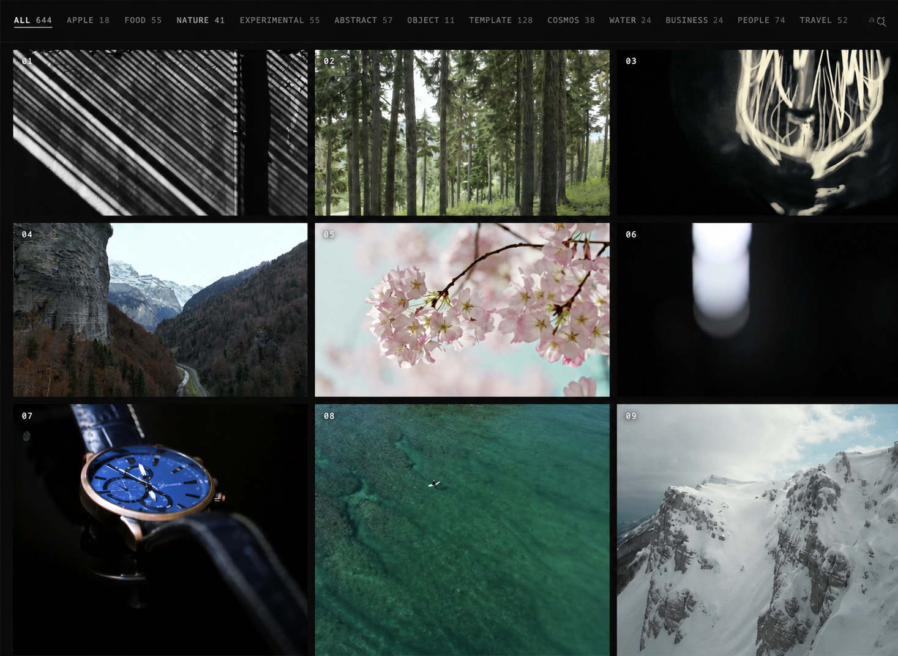
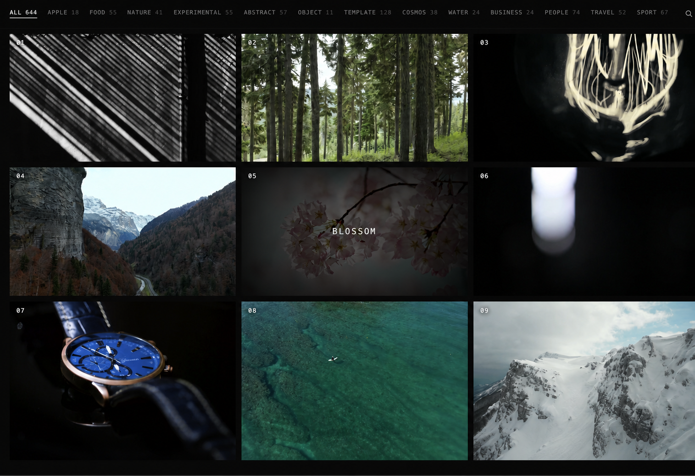
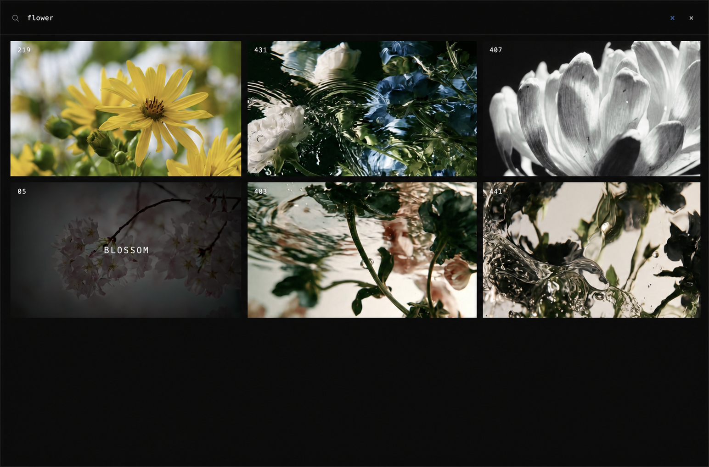
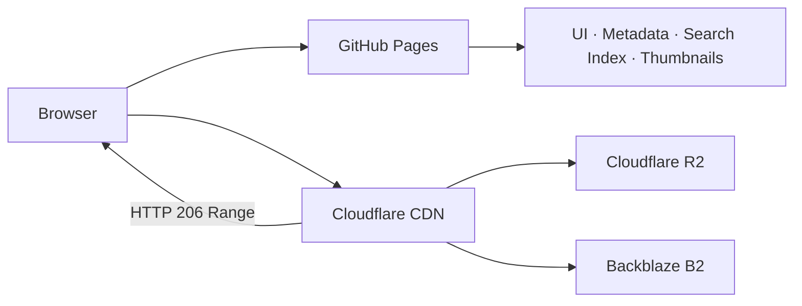

# Source Archive

Source Archive is a performance-focused video reference library and technical portfolio. It explores how hundreds of large visual sources can remain searchable, previewable, and responsive inside a static website.

Source Archive는 수백 개의 대용량 영상 소스를 정적 웹사이트에서 빠르게 검색하고 미리 보며 부드럽게 탐색하기 위해 만든 영상 레퍼런스 라이브러리이자 기술 포트폴리오입니다.

## Live Site / 라이브 사이트



[oosuhada.github.io/source-archive](https://oosuhada.github.io/source-archive/)

## Why I Built It / 문제의식

The project began after seeing [pear.no](https://pear.no/) and wanting to build an experience in which moving images behave like browsable visual material. My first approach was to generate the source footage myself with Google Cloud Console and Veo 3. That experiment was useful, but the outputs were difficult to direct: people teleported between frames, one person occasionally became two, realistic scenes drifted into fantasy, and detailed correction prompts often consumed more credits without reliably fixing the shot.

이 프로젝트는 [pear.no](https://pear.no/)에서 영감을 받아 움직이는 이미지를 탐색 가능한 시각 재료처럼 다루는 웹 경험을 구현해보고 싶다는 생각에서 시작했습니다. 처음에는 Google Cloud Console과 Veo 3를 활용해 필요한 영상을 직접 생성하려 했습니다. 하지만 사람이 프레임 사이에서 순간이동하거나 한 명이 두 명으로 복제되고, 현실적인 장면이 판타지처럼 변형되는 문제가 반복됐습니다. 세부 수정 명령도 결과에 안정적으로 반영되지 않았고 크레딧만 빠르게 소모됐습니다.

That failure changed the question. Instead of regenerating every visual whenever a project needed it, I decided to build a reusable archive of selected source files in advance. The website became both a practical library for future work and an engineering exercise in storing, delivering, searching, and scrubbing a growing collection of video efficiently.

이 실패를 겪으며 질문을 바꿨습니다. 프로젝트마다 필요한 영상을 다시 생성하기보다, 활용 가능성이 높은 소스 파일을 미리 선별해 재사용 가능한 아카이브로 구축하기로 했습니다. 그 결과 이 사이트는 향후 작업을 위한 실용적인 라이브러리인 동시에, 계속 증가하는 영상을 어떻게 저장하고 전달하며 검색하고 스크럽할 것인지 실험하는 엔지니어링 프로젝트가 됐습니다.

## Interface / 인터페이스



The gallery exposes the collection as a visual index instead of a conventional file browser.

갤러리는 파일 목록 대신 컬렉션 전체를 시각적 인덱스로 보여줍니다.



Short display titles keep the interface quiet, while richer hidden metadata makes related concepts discoverable.

화면에 보이는 제목은 짧게 유지하고, 풍부한 비표시 메타데이터를 활용해 관련 개념까지 검색되도록 설계했습니다.

## The First Performance Problem / 첫 번째 성능 문제

The initial implementation stored MP4 files in Cloudflare R2 and exposed them directly through an `r2.dev` public URL. This was inexpensive and convenient, but it was not an adequate delivery architecture for scroll-driven random seeking. A 1 MB byte-range test from a MacBook Air produced the following results:

초기 구현은 MP4 파일을 Cloudflare R2에 저장하고 `r2.dev` 공개 URL로 직접 제공했습니다. 비용과 설정 측면에서는 편리했지만, 스크롤 기반 random seek를 처리하기에는 적합한 최종 구조가 아니었습니다. MacBook Air에서 1MB Range 요청을 측정한 결과는 다음과 같았습니다.

| Asset | 1 MB Range request |
| --- | ---: |
| `106_water-2.mp4` | 1.33 s |
| `113_snowfall.mp4` | 4.04 s |
| `274_ritual-approach.mp4` | 1.39 s |
| `106_water-2.jpg` on GitHub Pages | 0.24 s |

A normal player can hide some latency through sequential buffering. This interface maps scroll position directly to `video.currentTime`, so it repeatedly asks for small, non-sequential ranges. When one range takes one to four seconds, a moving image feels like a still image.

일반적인 영상 플레이어는 순차 버퍼링으로 지연을 어느 정도 감출 수 있습니다. 하지만 이 인터페이스는 스크롤 위치를 `video.currentTime`에 직접 연결하므로 작고 비연속적인 Range 요청을 반복합니다. Range 요청 하나가 1~4초 걸리면 영상은 움직이는 화면이 아니라 정지 이미지처럼 느껴집니다.

## Architecture Evolution / 아키텍처 개선 과정

The first change was to replace the raw `r2.dev` endpoint with the custom domain `source-media.oosu.dev`. A Cloudflare-owned custom domain makes edge caching available and allows cached objects to bypass the R2 gateway. The first cold request still measured about 1.43 seconds with `cf-cache-status: MISS`, proving that a custom domain alone was necessary but not sufficient.

첫 번째 개선은 `r2.dev` 직접 접근을 중단하고 `source-media.oosu.dev` custom domain을 연결한 것입니다. Cloudflare 소유 도메인을 사용하면 edge cache를 적용할 수 있고, 캐시된 객체는 R2 gateway를 우회해 전달될 수 있습니다. 하지만 첫 cold request는 `cf-cache-status: MISS` 상태에서 약 1.43초가 걸렸습니다. Custom domain은 필요한 기반이지만 그것만으로는 충분하지 않다는 사실을 확인했습니다.

As the archive grew beyond the preferred R2 storage allowance, new media was placed in Backblaze B2 and served through `source-media-b2.oosu.dev`. GitHub Pages remains responsible only for the application, metadata, search index, and thumbnails; MP4 files never enter the Git repository.

아카이브가 R2의 선호 저장 용량을 넘어서면서 신규 영상은 Backblaze B2에 저장하고 `source-media-b2.oosu.dev`를 통해 제공하도록 확장했습니다. GitHub Pages는 애플리케이션, 메타데이터, 검색 인덱스, 썸네일만 담당하며 MP4 파일은 Git 저장소에 포함하지 않습니다.



## Solutions Implemented / 적용한 해결책

### Seek-Friendly MP4 / 스크럽 친화적 MP4

Source videos are normalized as silent H.264 MP4 with `yuv420p`, Fast Start metadata, and keyframes roughly every 0.5 seconds. Resolution is constrained without forcing every source into a 16:9 crop. CI checks codec, pixel format, audio stream count, Fast Start, keyframe spacing, and recorded Range support.

영상은 오디오를 제거한 H.264 MP4, `yuv420p`, Fast Start 구조로 통일하고 약 0.5초마다 키프레임을 배치했습니다. 모든 영상을 16:9로 강제 crop하지 않으면서 과도한 해상도는 제한합니다. CI에서는 코덱, 픽셀 포맷, 오디오 스트림 수, Fast Start, 키프레임 간격, Range 지원 기록을 검사합니다.

### Lightweight Hover Preview / 저용량 Hover Preview

Gallery hover never falls back to a full source MP4. The current archive includes 178 dedicated four-second, 480p, audio-free previews stored in the immutable `/previews/` namespace. Items without a dedicated preview remain JPEG-only, preventing an accidental full-video download from a hover gesture.

갤러리 hover는 원본 MP4를 대신 불러오지 않습니다. 현재 178개 항목에 4초 길이의 480p 무음 preview를 별도 생성해 immutable `/previews/` 경로에 저장했습니다. 전용 preview가 없는 항목은 JPEG 상태를 유지하므로 단순한 hover로 전체 영상을 내려받지 않습니다.

### Progressive Gallery / 점진적 갤러리

Thumbnails use native lazy loading and asynchronous decoding. Only 48 cards are rendered initially, and the next batch is added near the viewport. This reduces the initial DOM and avoids large request bursts against GitHub Pages.

썸네일에는 native lazy loading과 비동기 decoding을 적용했습니다. 최초에는 48개 카드만 렌더링하고 viewport가 가까워질 때 다음 묶음을 추가합니다. 초기 DOM 크기를 줄이고 GitHub Pages로 요청이 한꺼번에 몰리는 현상을 완화합니다.

### Resilient Thumbnail Cache / 복원 가능한 썸네일 캐시

Concurrent thumbnail tests revealed intermittent GitHub Pages `503` responses. An early Service Worker cached every response, which could preserve an HTML error page under a JPEG request. The current worker caches only successful `image/*` responses, rejects `429` and `5xx` responses, retries transient failures, removes poisoned cache entries, and displays a stable placeholder only after browser-level retries are exhausted.

동시 썸네일 검사 과정에서 GitHub Pages가 간헐적으로 `503`을 반환한다는 사실을 발견했습니다. 초기 Service Worker는 응답 상태와 관계없이 모두 저장해 JPEG 요청 경로에 HTML 오류 페이지가 남을 수 있었습니다. 현재는 정상적인 `image/*` 응답만 캐시하고 `429` 및 `5xx`는 저장하지 않습니다. 일시 오류를 재시도하고 오염된 캐시를 삭제하며, 브라우저 재시도까지 실패한 경우에만 안정적인 placeholder를 표시합니다.

### Search Outside the Main Thread / 메인 스레드 밖의 검색

Visible titles are limited to one or two English words where possible and three only when necessary. Rich keywords, synonyms, categories, and original titles are preserved separately. A normalized search index is generated at build time, and scoring runs inside a Web Worker so typing and scrolling remain responsive.

표시 제목은 가능한 한 영어 한두 단어로 제한하고 불가피한 경우에만 세 단어를 사용합니다. 대신 풍부한 키워드, 동의어, 카테고리, 원본 제목을 별도로 보존합니다. 정규화된 검색 인덱스는 build 단계에서 생성하고 검색 점수 계산은 Web Worker에서 실행해 입력과 스크롤이 메인 스레드에서 끊기지 않도록 했습니다.

### Versioned Cache and Measurement / 버전 캐시와 성능 측정

The build script hashes the catalog, preview manifest, application code, and styles. A new hash creates a new Service Worker cache and removes obsolete or poisoned versions. Adding `?perf=1` displays LCP, search latency, result count, first-frame latency, seek latency, and transferred bytes.

Build script는 카탈로그, preview manifest, 애플리케이션 코드, 스타일을 해싱합니다. 새로운 hash는 새 Service Worker cache를 만들고 오래되거나 오염된 버전을 제거합니다. URL에 `?perf=1`을 추가하면 LCP, 검색 지연, 검색 결과 수, 첫 프레임, seek 지연, 전송량을 확인할 수 있습니다.

## Why Not a Mac Mini Origin? / Mac mini를 공개 Origin으로 사용하지 않은 이유

A Mac mini was evaluated as a self-hosted Range server. It offered control over Nginx or Caddy, `sendfile`, cache headers, and excellent LAN or Tailscale performance. It was kept as a possible private review or backup path rather than the public production origin because public availability would depend on a single machine, local upload bandwidth, power, TLS, tunneling, and manual recovery.

Mac mini를 자체 Range server로 활용하는 방안도 검토했습니다. Nginx나 Caddy, `sendfile`, cache header를 직접 조정할 수 있고 LAN이나 Tailscale 환경에서는 빠를 가능성이 높았습니다. 그러나 공개 서비스가 한 대의 장비, 로컬 업로드 회선, 전원, TLS, tunnel, 수동 복구에 의존하게 되므로 production origin이 아니라 개인 리뷰 또는 백업 경로 후보로 남겼습니다.

## Current Architecture / 현재 구성

- 644 searchable video items
- 427 MP4 files in Cloudflare R2
- 217 MP4 files in Backblaze B2
- 644 indexed JPEG thumbnails
- 178 dedicated hover previews

- 검색 가능한 영상 644개
- Cloudflare R2의 MP4 427개
- Backblaze B2의 MP4 217개
- 인덱싱된 JPEG 썸네일 644개
- 전용 hover preview 178개

```txt
https://source-media.oosu.dev/media/
https://source-media-b2.oosu.dev/media/
https://source-media-b2.oosu.dev/previews/
```

## Repository Structure / 저장소 구조

```txt
index.html                              Archive application and playback logic
styles/                                 Detail-page visual system
data/source-library-data.js             Core catalog metadata
data/source-library-youtube-data.js     Imported catalog metadata
data/experimental-import-manifest*.json Encoding and source provenance
data/search-metadata-audit.json         Title and keyword audit
data/search-index.json                  Generated browser search index
data/preview-manifest.json              Hover-preview routing
assets/thumbs/                          Search and card thumbnails
assets/readme/                          README interface captures
scripts/                                Import, encoding, upload, and validation tools
search-worker.js                        Off-main-thread search scoring
performance-dashboard.js               Opt-in runtime measurements
sw.js                                   Versioned application cache
```

The repository contains the interface, metadata, thumbnails, generated indexes, and reproducible tooling. Original and processed MP4 files are intentionally excluded from Git.

저장소에는 인터페이스, 메타데이터, 썸네일, 생성된 인덱스, 재현 가능한 도구만 포함합니다. 원본 및 처리된 MP4는 의도적으로 Git에서 제외합니다.

## Validation and Deployment / 검증과 배포

```sh
npm run build
npm run validate
npm run validate:network
```

The `archive quality` workflow runs on every pull request. It validates 644 metadata records and thumbnails, rejects retired visual themes, checks imported video properties, and samples live `206 Partial Content` responses with retry logic for transient network failures. GitHub Pages deploys only after repository changes are merged.

`archive quality` workflow는 모든 pull request에서 실행됩니다. 644개 메타데이터와 썸네일을 검사하고, 폐기한 visual theme의 재사용을 차단하며, import 영상 속성과 실제 `206 Partial Content` 응답을 확인합니다. 일시적인 네트워크 오류에는 재시도를 적용하며 저장소 변경이 병합된 후 GitHub Pages가 배포됩니다.

## Remaining Work / 남은 과제

The next major optimization is a complete 540p or low-bitrate 720p review set for detail pages. A second experiment will test background downloading and switching to a local Blob URL after the first load, which could make repeated scroll scrubbing independent of network Range latency. These are documented as future work rather than claimed as completed features.

다음 주요 과제는 상세 페이지 전체에 사용할 540p 또는 저비트레이트 720p review 세트를 만드는 것입니다. 이후에는 최초 로드와 동시에 영상을 background download하고 완료 후 local Blob URL로 전환해 반복 스크럽을 네트워크 Range 지연에서 분리하는 방식을 실험할 예정입니다. 아직 구현하지 않은 기능은 완료된 것처럼 표현하지 않고 후속 과제로 명시합니다.
