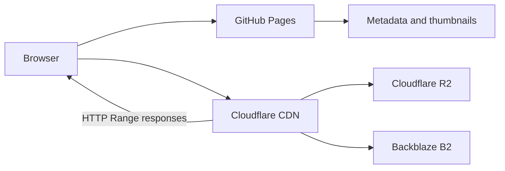

# Source Archive

Source Archive is a performance-focused video reference library and technical portfolio. It demonstrates how a static GitHub Pages interface can search hundreds of clips instantly and scrub large MP4 files smoothly through CDN-backed HTTP byte-range delivery.

## Live site

[oosuhada.github.io/source-archive](https://oosuhada.github.io/source-archive/)

## What this project demonstrates

- Multi-origin media storage with Cloudflare R2 and Backblaze B2
- Cloudflare CDN delivery with HTTP `Range` requests for responsive random seeking
- Scroll position mapped to `video.currentTime` for frame-oriented video exploration
- Seek-friendly H.264 MP4 encoding with frequent keyframes and Fast Start metadata
- Thumbnail-first rendering and lightweight client-side metadata search
- A serverless static architecture: GitHub Pages hosts only the UI, metadata, and thumbnails

## Architecture



The browser loads the small static catalog first. Full-resolution video is requested only when needed, while byte-range delivery lets the player seek without downloading an entire file.

## Performance design

### Scroll-driven video

Detail pages translate scroll progress into media time. Source files are prepared as H.264 MP4 with no audio, `yuv420p`, Fast Start, and closely spaced keyframes so nonlinear seeking stays responsive.

### Fast discovery

Archive cards initially use compact JPEG thumbnails. Search and category filtering run against local JavaScript metadata, avoiding a database round trip and keeping results immediate.

### Search-friendly metadata

Visible titles are intentionally concise—one or two English words where possible, and no more than three for newly imported clips. Search uses richer hidden metadata: concepts, subjects, visual properties, category terms, and useful synonyms. Import manifests preserve original source titles for traceability.

### Storage and delivery

MP4 assets are excluded from Git and distributed across two object-storage origins. Cloudflare provides the public delivery layer, stable caching, and range-aware playback while GitHub Pages remains a lean application host.

Current media bases:

```txt
https://source-media.oosu.dev/media/
https://source-media-b2.oosu.dev/media/
```

## Current archive

- 644 searchable video items
- 427 MP4 files in Cloudflare R2
- 217 MP4 files in Backblaze B2
- 644 locally indexed JPEG thumbnails

## Repository structure

```txt
index.html                              Archive application and playback logic
styles/                                 Archive and detail-page styling
data/source-library-data.js             Core catalog metadata
data/source-library-youtube-data.js     Imported catalog metadata
data/experimental-import-manifest*.json Source and encoding provenance
data/search-metadata-audit.json         Generated title and keyword audit
assets/thumbs/                          Search and card thumbnails
scripts/                                Repeatable metadata/import utilities
```

The repository contains the application, metadata, thumbnails, and reproducible tooling. Original and processed MP4 files are never committed to GitHub.

## Search model

Search combines each item's display title, category, and keyword vocabulary. Exact token matches rank above prefixes and partial matches, so a concise card title can remain visually clean while queries such as `flower`, `floral`, `blossom`, or `petals` still find the same relevant clip.

## Deployment

The site is deployed as a plain static GitHub Pages project. The `.nojekyll` marker keeps assets and routes untouched. Video origins must return `video/mp4`, support `206 Partial Content`, and expose stable immutable URLs for efficient CDN caching.
